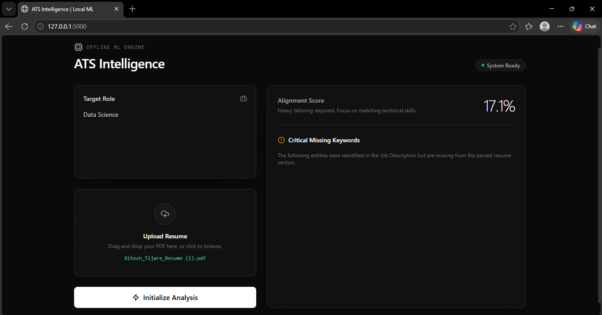

# 🎯 Ai-Resume-Analyzer

<div align="center">
  
  <br/>
  <p><strong>A privacy-first, 100% offline Machine Learning engine for high-precision Resume-to-JD alignment.</strong></p>
</div>

A privacy-first web application that uses offline Machine Learning to score your resume against a Job Description. 

Instead of sending your data to external APIs, this tool processes everything locally on your machine to find missing keywords and calculate an accurate match percentage.

## ✨ Features
* **Instant Match Score:** See how well your resume aligns with a job description.
* **Keyword Gap Analysis:** Tells you exactly which skills you need to add.
* **100% Offline & Private:** No API keys required. Your PDF never leaves your computer.
* **Clean UI:** Modern, dark-mode interface built with Tailwind CSS.

## 🛠️ Tech Stack
* **Frontend:** HTML, Tailwind CSS, Vanilla JS
* **Backend:** Python, Flask
* **Machine Learning:** `scikit-learn` (TF-IDF & Cosine Similarity)
* **Data Parsing:** `PyPDF2`

## 🚀 How to Run Locally

1. **Clone the repository:**
   ```bash
   git clone [https://github.com/Ritesh116/Ai-Resume-Analyzer.git](https://github.com/Ritesh116/Ai-Resume-Analyzer.git)
   
   ## Install the required libraries
   pip install Flask PyPDF2 scikit-learn

   ## To run the application
   python app.py

   **Open in Browser:**
   Go to `http://127.0.0.1:5000` to use the app.
